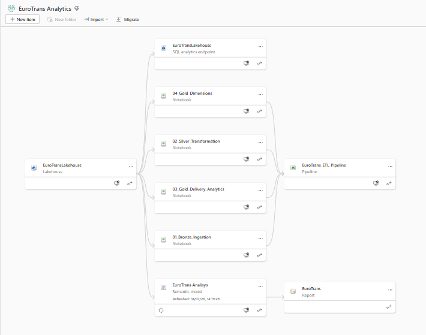
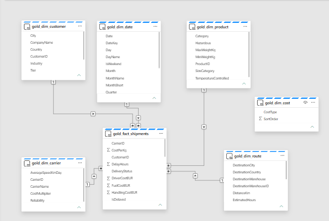
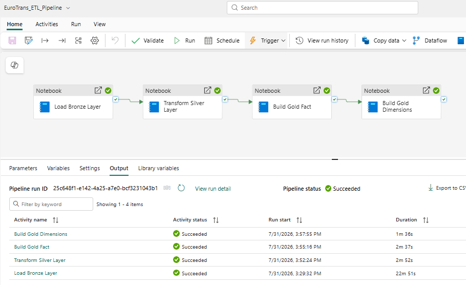
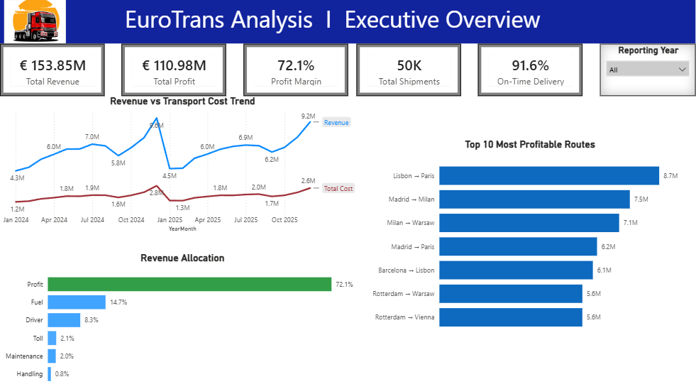
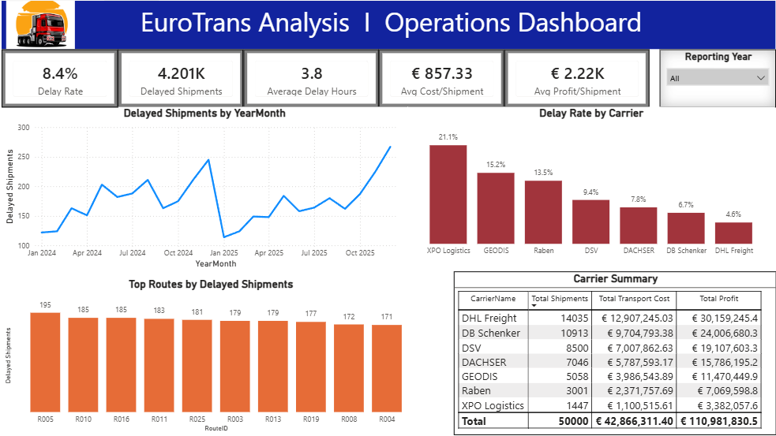
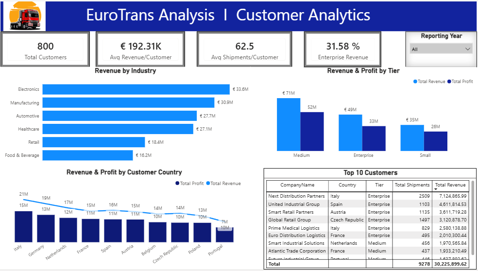

# 🚛 Logistics Analytics Platform

This project showcases practical experience in designing and implementing a modern analytics platform using Microsoft Fabric. It demonstrates the complete analytics lifecycle—from data ingestion and transformation to semantic modeling and executive reporting.

**Microsoft Fabric • Lakehouse • PySpark • SQL • Data Pipelines • Semantic Model • Power BI**

---

# Project Overview

The project implements a complete analytics workflow using Microsoft Fabric and Power BI.

The solution is built on a synthetically generated logistics dataset designed to simulate realistic business operations while avoiding the use of confidential company data.

The project demonstrates the ability to:

- Design an end-to-end analytics architecture in Microsoft Fabric
- Build a multi-layer Medallion Architecture (Bronze → Silver → Gold)
- Develop ETL workflows using PySpark notebooks
- ETL monitoring with execution audit logging
- Orchestrate data pipelines
- Create a Star Schema semantic model
- Deliver executive dashboards in Power BI

The final result is a complete analytics platform that showcases modern Microsoft Fabric capabilities, from data engineering to executive reporting.

---

# Solution Architecture

The complete analytics workflow was implemented within Microsoft Fabric.

Data is loaded into a Lakehouse, transformed through Bronze, Silver, and Gold layers using Spark notebooks, orchestrated by Data Pipelines, and consumed by Power BI through a Semantic Model.

---

# Data Model

The analytical model follows a **Star Schema** designed to optimize query performance and simplify analytical reporting.

A central fact table stores shipment transactions and is connected to multiple dimension tables that provide business context for customer, product, carrier, route, date, and cost analysis.

**Fact Table**

- `gold_fact_shipments`

**Dimension Tables**

- `gold_dim_customer`
- `gold_dim_product`
- `gold_dim_carrier`
- `gold_dim_route`
- `gold_dim_date`
- `gold_dim_cost`

The model serves as the foundation of the Semantic Model and supports efficient filtering, aggregation, and KPI calculations in Power BI.

---

# ETL Workflow

| Layer | Purpose | Key Transformations |
|-------|---------|----------------|
| **Bronze** | Load raw operational data into the Lakehouse | Ingest source data without applying business transformations |
| **Silver** | Clean and standardize the data | Remove duplicates, trim strings, validate schema, and improve data quality using PySpark |
| **Gold** | Create business-ready analytical tables | Calculate business metrics and prepare optimized fact and dimension tables for reporting |

---
## ETL Monitoring & Execution Audit

To improve ETL traceability, the solution includes an **ETL Audit Log** that captures execution metadata for every processed table across the Medallion Architecture.

The audit log records:

- Notebook name
- Processing layer (Bronze, Silver, Gold)
- Target table
- Row counts before and after processing
- Duplicate records removed
- Execution status
- Execution timestamp

Each pipeline execution appends a new audit record, providing historical execution traceability across all ETL stages.

This lightweight audit framework improves ETL observability by providing execution traceability and supporting monitoring and troubleshooting of data processing workflows.

---

# ETL Pipeline

The ETL process is fully orchestrated using **Microsoft Fabric Data Pipelines**.

The pipeline executes automatically every day at **5:30 AM**, providing a fully automated end-to-end data refresh.

Pipeline execution consists of four Spark notebooks:

1. Ingest Bronze Layer
2. Transform Silver Layer
3. Build Gold Fact
4. Build Gold Dimensions

Upon successful execution, the pipeline populates the Gold layer, records execution metadata in the **ETL Audit Log**, and makes the data available for reporting through the Semantic Model.

---

# Semantic Model

A Semantic Model was created in Microsoft Fabric to provide a centralized analytical layer for Power BI.

The model implements:

- Star Schema relationships
- Business-friendly semantic layer
- Optimized reporting structure
- Power BI integration

---

# Power BI Report

The Power BI report consists of three interactive pages designed for executive reporting, operational monitoring, and customer analytics.

---

## Executive Overview

Designed for executive-level monitoring of business performance.

Implemented features:

- KPI Cards
- Revenue Trend Analysis
- Cost Breakdown
- Route Profitability
- Interactive Year Filter

---

## Operations Dashboard

Focused on logistics performance monitoring.

Implemented features:

- Delay Analysis
- Carrier Performance
- Route Performance
- Operational KPIs
- Carrier Summary Table

---

## Customer Analytics

Provides customer segmentation and profitability analysis.

Implemented features:

- Revenue by Industry
- Customer Tier Analysis
- Country Performance
- Top Customers
- Customer KPI Monitoring

---

# Technology Stack

| Technology | Role in the Project |
|------------|---------------------|
| **Microsoft Fabric** | Unified analytics platform for data engineering and business intelligence |
| **Lakehouse** | Centralized storage for raw and transformed data |
| **PySpark** | Data ingestion, cleansing, and transformation |
| **Delta Lake** | Storage format for Bronze, Silver, and Gold tables |
| **SQL** | Data exploration, validation, and quality checks |
| **Data Pipelines** | ETL workflow orchestration |
| **Semantic Model** | Analytical layer for Power BI reporting |
| **Star Schema** | Dimensional data model optimized for analytics |
| **Power BI** | Interactive dashboards and executive reporting |

# Future Improvements

The project currently includes ETL execution auditing through the `etl_audit_log` table, capturing execution metadata such as processed row counts, duplicate removal statistics, execution status, and timestamps.

Potential production enhancements include:

- Pipeline Run ID propagation across all notebooks for end-to-end execution traceability
- Data reconciliation between Bronze, Silver, and Gold layers
- Automated data quality validation (null checks, schema validation, and business rules)
- Exception logging for failed transformations and rejected records
- ETL performance monitoring (execution duration and processing metrics)
- Automated notifications for ETL failures

This project was intentionally designed to demonstrate an end-to-end analytics solution while leaving room for additional enterprise-grade monitoring, data quality, and governance capabilities.

